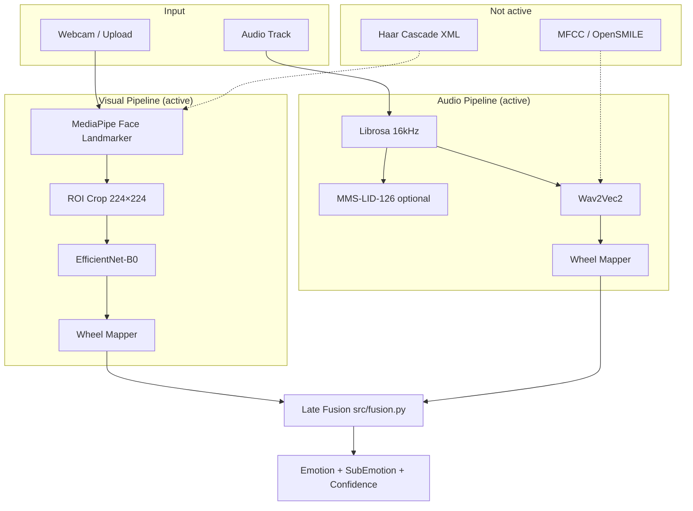
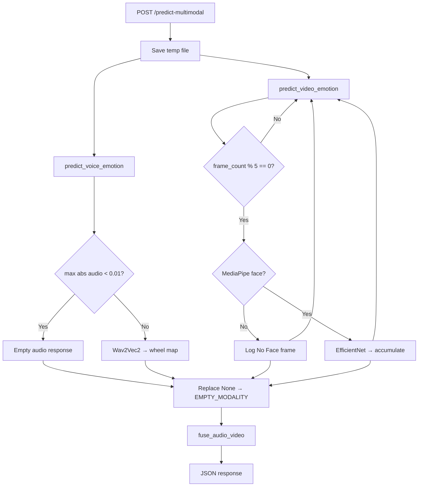

# Micro-Emotion Detection — Final Technical Documentation

Values from project source code. Items marked **(not active)** are present in the repo or referenced in code comments but not wired to the production `app.py` API.

***

## 1. Visual Pipeline Technical Assets

### Haar Cascade Configurations

#### File on disk (not active in production API)

| Item             | Detail                                                                  |
| ---------------- | ----------------------------------------------------------------------- |
| XML file         | `haarcascade_frontalface_default.xml` (repo root, \~33,314 lines)       |
| Type             | Stump-based 24×24 AdaBoost frontal face detector (Intel OpenCV library) |
| Feature type     | `HAAR` (per XML header)                                                 |
| Author / license | Rainer Lienhart; Intel Open Source CV Library License                   |

**Hyperparameters in this project:**

| Parameter      | Value in repo |
| -------------- | ------------- |
| `scaleFactor`  | 1.3           |
| `minNeighbors` | 5             |
| `minSize`      | (30,30)       |

No Python file calls `cv2.CascadeClassifier` or `detectMultiScale`.

**Standard OpenCV usage pattern** (for reference — not implemented here):

```python
face_cascade = cv2.CascadeClassifier("haarcascade_frontalface_default.xml")
gray = cv2.cvtColor(frame, cv2.COLOR_BGR2GRAY)
faces = face_cascade.detectMultiScale(gray, scaleFactor=1.3, minNeighbors=5, minSize=(30, 30))
# Returns list of (x, y, w, h) bounding boxes
```

**Why not used:** `src/face/mediapipe_face.py` states it *"Replaces Haar Cascade / MTCNN with real-time landmark-based face crops."* `scripts/preprocess_dataset_mediapipe.py` also notes MediaPipe replaces Haar for dataset cropping.

#### Active production detector — MediaPipe Face Landmarker

| Parameter                       | Value                                                                     |
| ------------------------------- | ------------------------------------------------------------------------- |
| Model                           | `face_landmarker.task` → cached at `src/face/models/face_landmarker.task` |
| Running mode                    | `VIDEO`                                                                   |
| `num_faces`                     | `2`                                                                       |
| `min_face_detection_confidence` | `0.5`                                                                     |
| `min_face_presence_confidence`  | `0.5`                                                                     |
| `min_tracking_confidence`       | `0.5`                                                                     |
| Frame timestamp                 | `+33 ms` per frame (\~30 FPS)                                             |
| Alternate detector              | `blaze_face_short_range.tflite` (only if `use_face_mesh=False`)           |

***

### MediaPipe Landmark Mask Indexing

468-point Face Mesh indices for eyes, eyebrows, and mouth zones (`src/face/landmarks.py`):

| Zone                          | Landmark ID | Constant              |
| ----------------------------- | ----------- | --------------------- |
| Nose tip (translation origin) | `1`         | `IDX_NOSE_TIP`        |
| Chin                          | `152`       | `IDX_CHIN`            |
| Left eye outer                | `33`        | `IDX_LEFT_EYE_OUTER`  |
| Right eye outer               | `263`       | `IDX_RIGHT_EYE_OUTER` |
| Left eyebrow                  | `70`        | `IDX_LEFT_EYEBROW`    |
| Right eyebrow                 | `300`       | `IDX_RIGHT_EYEBROW`   |
| Mouth left corner             | `61`        | `IDX_MOUTH_LEFT`      |
| Mouth right corner            | `291`       | `IDX_MOUTH_RIGHT`     |
| Upper lip                     | `13`        | `IDX_UPPER_LIP`       |
| Lower lip                     | `14`        | `IDX_LOWER_LIP`       |
| Left cheek                    | `234`       | `IDX_LEFT_CHEEK`      |
| Right cheek                   | `454`       | `IDX_RIGHT_CHEEK`     |

Inter-ocular reference pair: `(33, 263)`.

Landmark array shapes (`FaceResult` in `src/face/mediapipe_face.py`):

- `landmarks_normalized`: `(N, 3)` — x, y ∈ \[0,1], z = depth
- `landmarks_pixel`: `(N, 2)` — pixel coordinates

#### AU-like features (computed, not active in classifier)

`extract_au_like_features()` runs on every detected face. Output stored in `FaceResult.au_features` but `src/detector.py` never reads it.

| Feature key         | Formula                                      |
| ------------------- | -------------------------------------------- |
| `brow_raise_left`   | `dist(left_eyebrow, left_eye_outer) / IOD`   |
| `brow_raise_right`  | `dist(right_eyebrow, right_eye_outer) / IOD` |
| `brow_raise_mean`   | mean of above two                            |
| `mouth_width_ratio` | `dist(mouth_L, mouth_R) / face_width`        |
| `lip_opening`       | `dist(upper_lip, lower_lip) / IOD`           |
| `jaw_drop`          | `dist(chin, nose_tip) / IOD`                 |
| `smile_asymmetry`   | `mouth_right_y - mouth_left_y`               |

`au_features_to_vector()` → shape `(7,)`. Comment in code: *"Fixed-order vector for sklearn / torch fusion"* — fusion not implemented for AU vectors.

***

### ROI Normalization Mechanics

#### Expected Haar → MediaPipe pipeline (not active)

Typical pipeline this requirement describes:

```
Full frame (H, W, 3)
  → Haar detectMultiScale → (X, Y, W, H)
  → Crop ROI → resize (256, 256, 3)
  → MediaPipe Face Mesh on crop → (468, 3) landmarks
```

This project **skips Haar entirely**. MediaPipe receives the full RGB frame; bbox is built from landmarks.

#### Active production pipeline (`src/face/crop.py`, `src/detector.py`)

```python
# Step 1: Normalized landmark → pixel
px[:, 0] = landmarks[:, 0] * width
px[:, 1] = landmarks[:, 1] * height

# Step 2: Bbox from all landmark min/max + 12% margin
x1, y1 = int(xs.min()), int(ys.min())
x2, y2 = int(xs.max()), int(ys.max())
expand_box((x1, y1, x2, y2), w, h, margin_ratio=0.12)

# Step 3: Extra margin for emotion model
expand_box(box, w, h, margin_px=20, margin_ratio=0.12)
crop = rgb[y1:y2, x1:x2]          # variable (crop_h, crop_w, 3)

# Step 4: Classifier preprocessing
Resize((224, 224)) → ToTensor()
Normalize(mean=[0.485, 0.456, 0.406], std=[0.229, 0.224, 0.225])
```

| Parameter           | Value           |
| ------------------- | --------------- |
| `FACE_MARGIN_RATIO` | `0.12`          |
| `FACE_MARGIN_PX`    | `20`            |
| Model input         | `224 × 224` RGB |

#### Legacy alternate ROI path (not active in `app.py`)

`src/emotions.py --mode display` uses MediaPipe bbox → grayscale crop → `48×48`:

```python
roi_gray = gray[y1:y2, x1:x2]
cropped = cv2.resize(roi_gray, (48, 48))
input = cropped / 255.0 → shape (1, 48, 48, 1)  # legacy FER CNN
```

***

### Spatial Distortion Resilience Data

| Condition               | Active handling in code                                                  |
| ----------------------- | ------------------------------------------------------------------------ |
| Head tilt / yaw / pitch | Bbox from all 468 landmark min/max adapts to pose                        |
| Scale variation         | `normalize_landmarks_face_relative()` — nose-origin + inter-ocular scale |
| Temporal tracking       | MediaPipe `VIDEO` mode, `+33 ms` monotonic timestamps                    |
| Multi-face scenes       | `MAX_NUM_FACES=2`; `process_largest()` selects biggest area              |
| Brief occlusion         | Undetected frames skipped; no interpolation                              |
| Zero faces in video     | `valid_face_frames == 0` → `emotion: "No Face"`, `confidence: 0.0`       |

**Temporal micro-displacement tracking (not active):** No frame-to-frame landmark velocity or delta features. Would require:

```
Δp_t = landmarks_t - landmarks_{t-1}
v_t  = Δp_t / Δt_ms
```

Only per-frame static geometry (AU-like features) is computed.

***

## 2. Audio Pipeline Technical Assets

### Acoustic Configuration Parameters

#### Active parameters (`src/voice_detector.py`)

| Parameter         | Value                                            |
| ----------------- | ------------------------------------------------ |
| Library           | `librosa` (decode + resample only)               |
| Sample rate       | `16000 Hz` (`SAMPLE_RATE = 16000`)               |
| Channels          | Mono                                             |
| Max input length  | `160000` samples (\~10 s at 16 kHz)              |
| Truncation        | `True`                                           |
| Padding           | `True`                                           |
| Silent-audio gate | `max(abs(audio)) < 0.01` → empty response        |
| Classifier        | `Dpngtm/wav2vec2-emotion-recognition` (Wav2Vec2) |

#### MFCC / spectral features (not active — reference specification)

Not called in any `.py` file. Standard librosa MFCC pipeline for comparison:

```python
# Reference only — NOT in this codebase
mfcc = librosa.feature.mfcc(
    y=audio, sr=16000,
    n_mfcc=13,           # typical count
    n_fft=400,           # 25 ms window at 16 kHz
    hop_length=160,      # 10 ms hop at 16 kHz
)
# Output shape: (13, num_frames)
```

| Parameter   | Typical research value         | In this project     |
| ----------- | ------------------------------ | ------------------- |
| Sample rate | 16 kHz                         | **16 kHz** (active) |
| Window size | 25 ms (400 samples)            | Not implemented     |
| Hop length  | 10 ms (160 samples)            | Not implemented     |
| MFCC count  | 13                             | Not implemented     |
| OpenSMILE   | eGeMAPS / ComParE feature sets | Not implemented     |

Wav2Vec2 learns acoustic representations internally from raw waveform. `src/voice_detector.py` comment: *"emotion is conveyed via acoustic prosody (pitch, energy, rhythm), not language-specific words."*

***

### Prosodic Feature Extraction Scripts

#### Manual prosody (not active — definitions)

| Feature                        | Definition                          | In this project                     |
| ------------------------------ | ----------------------------------- | ----------------------------------- |
| **F₀** (fundamental frequency) | Pitch contour of voiced speech (Hz) | Not extracted; implicit in Wav2Vec2 |
| **Speech energy**              | RMS or log-energy per frame         | Not extracted                       |
| **Jitter**                     | Cycle-to-cycle F₀ period variation  | Not extracted                       |
| **Shimmer**                    | Cycle-to-cycle amplitude variation  | Not extracted                       |

Standard extraction would use `librosa.pyin` or autocorrelation for F₀, then:

```
jitter = mean(|T_i - T_{i+1}|) / mean(T_i)     # T = fundamental period
shimmer = mean(|A_i - A_{i+1}|) / mean(A_i)    # A = peak amplitude
```

#### Active audio inference path

```python
audio, _ = librosa.load(audio_path, sr=16000, mono=True)
inputs = _emo_processor(audio, sampling_rate=16000, max_length=160000, truncation=True)
probs = softmax(_emo_model(inputs.input_values).logits)
```

Optional language detection: `facebook/mms-lid-126`

| Env var                  | Effect                                 |
| ------------------------ | -------------------------------------- |
| `DISABLE_LANG_DETECT=1`  | Skip language model load               |
| `LID_LOAD_TIMEOUT`       | Default `30` s wait for model download |
| `TRANSFORMERS_OFFLINE=1` | Cached models only                     |

**Language confidence scaling** (`LANG_CONFIDENCE_SCALE`): eng=1.00, hin=0.90, mar=0.88, unknown=0.80

***

## 3. Synchronization & Model Fusion Topology

### Bimodal Time-Alignment Logic

#### Active: clip-level alignment (`app.py`)

```python
audio_result = predict_voice_emotion(media_path)    # entire clip
video_result = predict_video_emotion(media_path)    # entire clip, frame_step=5
combined_result = fuse_audio_video(audio_result, video_result)
```

| Parameter              | Value                                     |
| ---------------------- | ----------------------------------------- |
| Video frame sampling   | Every 5th frame (`frame_step=5`, default) |
| MediaPipe tracking     | `+33 ms`/frame (\~30 FPS)                 |
| Audio window           | Full clip, max 10 s (160000 samples)      |
| Webcam demo resolution | `1280 × 720` (`scripts/webcam_demo.py`)   |

#### Millisecond streaming sync (not active — reference design)

Not implemented. A typical 30 FPS sync would segment audio per video frame:

```
frame_duration_ms = 1000 / 30 ≈ 33.3 ms
audio_chunk_samples = int(16000 * frame_duration_ms / 1000) ≈ 533 samples per frame
```

This project processes audio and video independently at clip level, then fuses final score vectors.

***

### Fusion Matrix Architecture

#### Active: Late Fusion — Soft Weighted Average (`src/fusion.py`)

```python
combined_score[base] = audio_weight × audio_score[base] + video_weight × video_score[base]
```

Applied to 8 wheel bases: Sad, Scared, Angry, Embarrassed, Happy, Loved, Confident, Neutral.

#### All fusion methods — specification

| Method                         | Formula / description                                                    | Active? |
| ------------------------------ | ------------------------------------------------------------------------ | ------- |
| **Early fusion**               | `features = concat(visual_features, audio_features)` → single classifier | No      |
| **Late fusion (soft)**         | `S = w_a·S_a + w_v·S_v` per class                                        | **Yes** |
| **Hard / majority voting**     | `class = mode(argmax(audio), argmax(video))`                             | No      |
| **Cross-attention**            | `Attention(Q=visual, K=audio, V=audio)` weighted fusion                  | No      |
| **Meta-classifier / stacking** | Third model trained on `[audio_probs, video_probs]`                      | No      |

Active weights: base **video=0.60**, **audio=0.40**, scaled by quality scores then normalized.

***

### Classifier Summary Printout

#### Visual — EfficientNet-B0 (active, `src/detector.py`)

| Property  | Value                                                         |
| --------- | ------------------------------------------------------------- |
| Weights   | `src/models/enet_b0_8_best_vgaf.pt`                           |
| Framework | PyTorch (`torch.load`, `model.eval()`)                        |
| Input     | `(1, 3, 224, 224)` ImageNet-normalized RGB                    |
| Output    | 8-class softmax                                               |
| Classes   | Anger, Contempt, Disgust, Fear, Happy, Neutral, Sad, Surprise |
| Device    | CUDA if available, else CPU                                   |

**Wheel mapping** (`AFFECTNET_TO_WHEEL_BASE`): Anger→Angry, Contempt→Confident, Disgust→Embarrassed, Fear→Scared, Happy→Happy, Neutral→Neutral, Sad→Sad, Surprise→Happy

#### Audio — Wav2Vec2 (active, `src/voice_detector.py`)

| Property  | Value                                         |
| --------- | --------------------------------------------- |
| Model     | `Dpngtm/wav2vec2-emotion-recognition`         |
| Framework | HuggingFace Transformers                      |
| Input     | Raw waveform `(≤160000,)` at 16 kHz           |
| Output    | Softmax over `VOICE_LABELS` from model config |

**Wheel mapping** (`VOICE_TO_WHEEL_BASE`): neutral/calm→Neutral, happy→Happy, sad→Sad, angry→Angry, fearful/fear→Scared, disgust→Embarrassed, surprised/surprise→Happy

#### Legacy FER CNN (not active in `app.py`, `src/emotions.py` / `src/evaluate_fer.py`)

```
Conv2D(32,3×3,relu)   input (48,48,1)
Conv2D(64,3×3,relu) → MaxPool(2×2) → Dropout(0.25)
Conv2D(128,3×3,relu) → MaxPool(2×2)
Conv2D(128,3×3,relu) → MaxPool(2×2) → Dropout(0.25)
Flatten → Dense(1024,relu) → Dropout(0.5) → Dense(7,softmax)
```

7 classes: Angry, Disgust, Fear, Happy, Neutral, Sad, Surprise

Weights on disk: `src/models/fer.h5`. Also present but unused: `src/models/affectnet.h5`, `src/models/affectnet.pt`.

***

### Training Hyperparameters

#### Production models (active inference only)

EfficientNet-B0 and Wav2Vec2 are **pretrained** — no training config in this repo.

#### Legacy FER CNN training (`src/emotions.py --mode train`, not active in API)

| Parameter               | Value                             |
| ----------------------- | --------------------------------- |
| Optimizer               | `Adam(lr=0.0001, decay=1e-6)`     |
| Loss                    | `categorical_crossentropy`        |
| Batch size              | `64`                              |
| Epochs                  | `50`                              |
| Input                   | `48×48` grayscale, `/255` rescale |
| `train_dir` / `val_dir` | `data/train`, `data/test`         |
| Train samples           | `28709`                           |
| Val samples             | `7178`                            |
| Saves to                | `model.h5` (project root cwd)     |

`src/dataset_prepare.py` reads `fer2013.csv` but writes PNGs to `train/` and `test/` at project root (not `data/train/`).

***

## 4. Mathematical Equations & Code Logic

### Feature Engineering Equations

**Face-relative normalization** (active, `src/face/landmarks.py`):

```
origin = pts[nose_tip]
pts = landmarks[:, :2] - origin
IOD = ||pts[right_eye] - pts[left_eye]||
if IOD < 1e-6: IOD = 1.0
pts_normalized = pts / IOD
```

**AU-like ratios** (active computation, not active in classifier):

| Feature         | Equation                              |
| --------------- | ------------------------------------- |
| Brow raise      | `dist(eyebrow, eye_outer) / IOD`      |
| Mouth width     | `dist(mouth_L, mouth_R) / face_width` |
| Lip opening     | `dist(upper_lip, lower_lip) / IOD`    |
| Jaw drop        | `dist(chin, nose) / IOD`              |
| Smile asymmetry | `mouth_right_y - mouth_left_y`        |

**Temporal micro-displacements** (not active):

```
Δ_landmark_t = landmark_t - landmark_{t-1}
ratio_t      = ||Δ_landmark_t|| / IOD_t
```

**Sub-emotion thresholds** (active, `WHEEL_SUB_MAP`):

```
confidence ≥ 75.0  →  tier-1 sub-emotion
confidence ≥ 45.0  →  tier-2 sub-emotion
confidence ≥  0.0  →  tier-3 sub-emotion
else               →  "None"
```

**Fusion equations** (active, `src/fusion.py`):

```
Q_audio = clip((max_prob - 0.125) / 0.875, 0, 1)
Q_video = clip(validFaceFrames / sampledFrames, 0, 1)
w_a_raw = 0.4 × Q_audio;  w_v_raw = 0.6 × Q_video
if w_a_raw + w_v_raw == 0: w_a_raw, w_v_raw = 0.4, 0.6
w_audio = w_a_raw / (w_a_raw + w_v_raw)
w_video = w_v_raw / (w_a_raw + w_v_raw)
S_combined(b) = w_audio × S_audio(b) + w_video × S_video(b)
```

***

### Pipeline Data-Shape Tracking Table

| Stage                     | Shape                          | Active?            |
| ------------------------- | ------------------------------ | ------------------ |
| Raw video frame           | `(H, W, 3)` BGR                | Yes                |
| Haar crop ROI             | `(256, 256, 3)`                | No — not produced  |
| RGB frame                 | `(H, W, 3)`                    | Yes                |
| MediaPipe mesh            | `(468, 3)` normalized          | Yes                |
| Pixel landmarks           | `(468, 2)`                     | Yes                |
| Native face crop          | `(crop_h, crop_w, 3)` variable | Yes                |
| Emotion model input       | `(1, 3, 224, 224)`             | Yes                |
| Face class probabilities  | `(8, 1)`                       | Yes                |
| Face wheel base scores    | `(8, 1)` 0–100                 | Yes                |
| AU feature vector         | `(7, 1)`                       | Computed only      |
| Raw audio waveform        | `(num_samples,)` 16 kHz        | Yes                |
| MFCC features             | `(13, num_frames)`             | No — not extracted |
| Wav2Vec2 input            | `(1, ≤160000)`                 | Yes                |
| Audio class probabilities | `(num_labels, 1)`              | Yes                |
| Audio wheel base scores   | `(8, 1)`                       | Yes                |
| Fused vector              | `(8, 1)`                       | Yes                |
| Fused decision output     | scalar (1 of 8)                | Yes                |

***

### The Main Loop Code (Pseudocode)

```python
# app.py → predict_multimodal (active production loop)
media_path = save_upload("media")   # temp/{uuid}{ext}

# ── Audio branch ──
audio = librosa.load(media_path, sr=16000, mono=True)
if max(abs(audio)) < 0.01:
    audio_result = empty_voice_response("Silent audio")
else:
    lang_info = detect_language(audio)           # optional MMS-LID-126
    label_scores = wav2vec2_softmax(audio)
    audio_result = build_voice_response(label_scores, lang_info)

# ── Video branch ──
cap = cv2.VideoCapture(media_path)
preds_sum = zeros(8)
for frame_count, frame in enumerate(cap, 1):
    if frame_count % 5 != 0: continue
    rgb = BGR2RGB(frame)
    face = mediapipe.process_largest(rgb)
    if face is None:
        append frameResult(hasFace=False, emotion="No Face"); continue
    crop = expand_box(face.bbox) → resize 224×224
    probs = efficientnet_b0_softmax(crop)
    preds_sum += probs; valid_face_frames += 1
video_result = build_emotion_response(preds_sum / valid_face_frames)

# ── Fusion ──
if audio_result.category == "None": audio_result = EMPTY_MODALITY_RESPONSE
if video_result.category == "None": video_result = EMPTY_MODALITY_RESPONSE
combined = fuse_audio_video(audio_result, video_result)
return {audioResult, videoResult, combinedResult}
```

***

## 5. Flowcharts & System Architecture Diagrams

> **Note:** Journal typesetting requires `.SVG`, `.PDF`, or `.EPS` exports. None exist in the repo. Mermaid source provided below for export.

### System Block Diagram



### Sequential Logic Flowchart



### Temporal Timeline Alignment Graph

```mermaid
gantt
    title Active: Clip-Level vs Reference: Per-Frame Sync
    dateFormat X
    axisFormat %s
    section Audio active
    Full clip Wav2Vec2 :a1, 0, 10
    section Video active
    Frame 5 sampled :v1, 0, 1
    Frame 10 sampled :v2, 1, 2
    Frame 15 sampled :v3, 2, 3
    Average probs :v4, 3, 4
    section Fusion active
    Combine vectors :f1, 10, 11
    section Reference not active
    Per-frame audio chunks :r1, 0, 4
```



***

## 7. Decision-Level Fusion & Synchronization Logic

### The Decision Combination Rule

| Method                         | Description                                     | Active? |
| ------------------------------ | ----------------------------------------------- | ------- |
| **Hard / Majority Voting**     | `final = mode(argmax(audio), argmax(video))`    | No      |
| **Soft / Weighted Average**    | `S = w_a·S_a + w_v·S_v` per wheel base          | **Yes** |
| **Meta-Classifier / Stacking** | `final = MLP(concat(audio_probs, video_probs))` | No      |

**Active formula** (`src/fusion.py`):

```
S_combined(b) = w_audio × S_audio(b) + w_video × S_video(b)

w_audio = (0.4 × Q_audio) / (0.4 × Q_audio + 0.6 × Q_video)
w_video = (0.6 × Q_video) / (0.4 × Q_audio + 0.6 × Q_video)

Q_audio = (max_prob - 0.125) / 0.875
Q_video = validFaceFrames / sampledFrames

Final class = argmax_b(S_combined(b))
sub_emotion = get_active_sub(final, S_combined(final))
```

**Base weights:** Video = **0.60**, Audio = **0.40**

**Single-modality fallback:**

| Case       | `weightsUsed`                             |
| ---------- | ----------------------------------------- |
| Audio only | `{audio: 1.0, video: 0.0}`                |
| Video only | `{audio: 0.0, video: 1.0}`                |
| Neither    | `{audio: 0.0, video: 0.0}` → all `"None"` |

***

### Asynchronous Time-Alignment Script

**Micro-expression duration (reference):** 40–200 ms (1/25 to 1/3 second). Not explicitly modeled.

**Active clip-level logic:**

1. Audio: full clip as one Wav2Vec2 window (≤10 s).
2. Video: every 5th frame → MediaPipe + EfficientNet.
3. Visual: `avg_preds = preds_sum / valid_face_frames`.
4. Fusion: combine clip-level wheel vectors — no timestamp alignment.

**Reference per-frame alignment (not active):**

```python
# Not in codebase — illustrative
for frame_t in sampled_frames:
    audio_segment = audio[t_ms : t_ms + frame_duration_ms]
    visual_pred = model(frame_t)
    audio_pred  = model(audio_segment)
    fuse(visual_pred, audio_pred)
```

***

### Pipeline Data-Shape Tracking Table (Fusion Path)

```
Raw Video Frame       (H, W, 3)
    → [Haar ROI]      (256, 256, 3)         ← not produced
    → MediaPipe Mesh  (468, 3)
    → Face Crop       (crop_h, crop_w, 3) → (224, 224, 3)
    → Face Probs      (8, 1)
    → Wheel Scores    (8, 1)

Raw Audio Window      (≤160000,) at 16 kHz
    → [MFCC Vector]   (13, T)               ← not extracted
    → Wav2Vec2 Probs  (num_labels, 1)
    → Wheel Scores    (8, 1)

Fused Decision        argmax over (8, 1) combined scores
```

***

## 8. Empirical Benchmark & Validation Metrics

### Dataset Slicing Metrics

| Dataset       | Role                                   | Split counts in repo                                         | Active?                 |
| ------------- | -------------------------------------- | ------------------------------------------------------------ | ----------------------- |
| **AffectNet** | EfficientNet-B0 pretraining (external) | No split in repo                                             | Pretrained weights only |
| **RAVDESS**   | Speech emotion benchmark               | `src/evaluate_ravdess.py` — user provides `--data_dir`       | Evaluation script only  |
| **FER2013**   | Legacy CNN training                    | Train **28,709** / Test **7,178** (`src/dataset_prepare.py`) | Legacy only             |
| **MELD**      | Multimodal emotion dialog dataset      | Not referenced in any file                                   | No                      |
| **CASME II**  | Spontaneous micro-expression dataset   | Not referenced in any file                                   | No                      |

**MELD (reference):** \~13,000 utterances from TV dialog; multimodal (text + audio + video); emotion labels including joy, sadness, anger, fear, surprise, disgust, neutral.

**CASME II (reference):** Spontaneous micro-expression dataset; \~255 samples; 5 micro-expression categories (happiness, disgust, repression, surprise, others); frame-level labeling at high FPS.

**RAVDESS filename parsing** (`src/evaluate_ravdess.py`):

| Code (field index 2) | Label     |
| -------------------- | --------- |
| 01                   | neutral   |
| 02                   | calm      |
| 03                   | happy     |
| 04                   | sad       |
| 05                   | angry     |
| 06                   | fearful   |
| 07                   | disgust   |
| 08                   | surprised |

***

### Decision-Level Ablation Study Data

No committed results in repo. How each arm can be produced:

| Configuration      | How to run                               | Model used                  |
| ------------------ | ---------------------------------------- | --------------------------- |
| **Visual only**    | `POST /predict` or `POST /predict-video` | MediaPipe + EfficientNet-B0 |
| **Acoustic only**  | `POST /predict-audio`                    | Librosa + Wav2Vec2          |
| **Decision-fused** | `POST /predict-multimodal`               | Both + `fuse_audio_video()` |

**Offline evaluation scripts (not fused ablation):**

| Script                    | Modality | Default model                                               |
| ------------------------- | -------- | ----------------------------------------------------------- |
| `src/evaluate_fer.py`     | Visual   | Legacy 7-class CNN (`--weights src/model.h5`)               |
| `src/evaluate_ravdess.py` | Audio    | `ehcalabres/wav2vec2-lg-xlsr-en-speech-emotion-recognition` |

No `*_metrics.json` files committed. No script computes fused F1-score.

**Metrics JSON structure** (produced when scripts are run):

```json
{
  "accuracy": float,
  "macro_precision": float,
  "macro_recall": float,
  "macro_f1": float,
  "uar": float,
  "num_samples": int,
  "labels": [...],
  "confusion_matrix": [[...]],
  "per_class": {
    "<label>": {"precision": float, "recall": float, "f1": float, "support": int}
  }
}
```

***

### Computational Efficiency Metrics

| Metric                   | Value / source                        | Active measurement?                     |
| ------------------------ | ------------------------------------- | --------------------------------------- |
| Video frame step         | `5` (`predict_video_emotion` default) | Config only                             |
| MediaPipe timestamp step | `33 ms`/frame                         | Config only                             |
| Webcam FPS formula       | `fps_smooth = 0.9*old + 0.1*(1/dt)`   | Display only (`scripts/webcam_demo.py`) |
| Flask port               | `5000`                                | Yes                                     |
| GPU                      | CUDA if `torch.cuda.is_available()`   | Runtime                                 |
| Per-frame latency (ms)   | —                                     | Not measured                            |
| CPU/GPU memory footprint | —                                     | Not measured                            |
| Fusion overhead (ms)     | —                                     | Not measured                            |

***

### Model Evaluation Graphics

No confusion matrix images or CSV exports committed in repo.

`src/evaluate_fer.py` writes to `--output` (default `src/fer_metrics.json`).
`src/evaluate_ravdess.py` writes to `--output` (default `src/ravdess_metrics.json`).

`src/emotions.py --mode train` saves accuracy/loss plot to `plot.png` (legacy training only).

Per-class metrics available in JSON: precision, recall, F1, support for each emotion label.

***

### Data Validation & Confidence Threshold Algorithms

**Sub-emotion tier selection** (active — `WHEEL_SUB_MAP` in `detector.py`, `voice_detector.py`, `fusion.py`):

| Confidence (%) | Tier   | Example (Happy base) |
| -------------- | ------ | -------------------- |
| 100 – 75       | Tier 1 | Excited              |
| 75 – 45        | Tier 2 | Grateful             |
| 45 – 0         | Tier 3 | Caring               |
| < 0            | None   | None                 |

```python
def get_active_sub(base, confidence):
    for min_conf, sub_label in WHEEL_SUB_MAP[base]:
        if confidence >= min_conf:
            return sub_label
    return "None"
```

**Full wheel base → sub-emotion map:**

| Wheel base  | Tier 1 (≥75) | Tier 2 (≥45) | Tier 3 (≥0) |
| ----------- | ------------ | ------------ | ----------- |
| Sad         | Hurt         | Disappointed | Lonely      |
| Scared      | Overwhelmed  | Powerless    | Anxious     |
| Angry       | Annoyed      | Jealous      | Bored       |
| Embarrassed | Ashamed      | Excluded     | Guilty      |
| Happy       | Excited      | Grateful     | Caring      |
| Neutral     | Creative     | Calm         | Relaxed     |
| Loved       | Respected    | Valued       | Accepted    |
| Confident   | Powerful     | Brave        | Hopeful     |

**Audio language confidence scaling** (active):

| Language      | Scale |
| ------------- | ----- |
| English (eng) | 1.00  |
| Hindi (hin)   | 0.90  |
| Marathi (mar) | 0.88  |
| Unknown       | 0.80  |

**Fusion quality gating** (active):

- Audio: decisiveness vs. random 8-class baseline (12.5%).
- Video: face detection rate `validFaceFrames / sampledFrames`.

**Defined but unused category maps** (present in code, not called):

- `AFFECTNET_TO_CATEGORY` in `src/detector.py`
- `VOICE_TO_CATEGORY` in `src/voice_detector.py`

Actual `category` field always comes from `WHEEL_ORDER` tuple paired with top wheel base.

***

*Source: project codebase — June 2026.*
